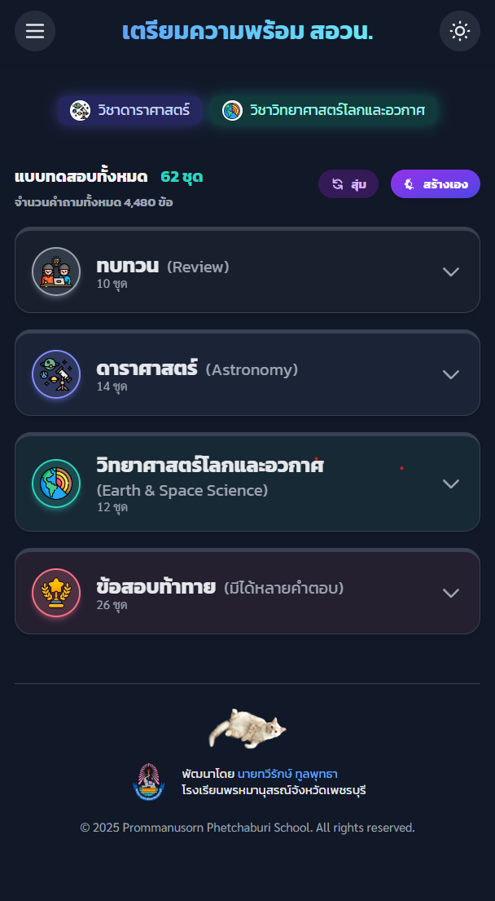

# Earth Science Quiz - แบบทดสอบเตรียมความพร้อม สอวน.

<div align="center">
  <!-- Badges for professionalism -->
  
  
</div>
<br>
<div align="center">
  
  <p><i>ภาพหน้าจอของแอปพลิเคชัน </i></p>
</div>

เว็บแอปพลิเคชันสำหรับฝึกทำแบบทดสอบออนไลน์ เพื่อช่วยนักเรียนเตรียมความพร้อมในการสอบคัดเลือกเข้าค่ายโอลิมปิกวิชาการ (สอวน.) ในสาขาวิชาดาราศาสตร์ และวิชาวิทยาศาสตร์โลกและอวกาศ   มาพร้อมกับหน้าตาที่เรียบง่าย สะอาดตา โหมดการทำข้อสอบที่หลากหลาย และระบบติดตามสถิติอย่างละเอียด

<div align="center">

**[🚀 เข้าสู่เว็บไซต์ (Live Demo) 🚀](https://golftaweerak.github.io/EarthScienceQuiz/)**

</div>

---

## ✨ คุณสมบัติเด่น (Features)

- **หมวดหมู่หลากหลาย:** ครอบคลุมเนื้อหาทั้งวิทยาศาสตร์โลก ดาราศาสตร์ และความรู้ทั่วไป
- **Responsive Design:** ใช้งานได้ดีบนทุกอุปกรณ์ ทั้งคอมพิวเตอร์ แท็บเล็ต และโทรศัพท์มือถือ
- **โหมดมืด (Dark Mode):** ถนอมสายตาเมื่อใช้งานในที่แสงน้อย
- **ตัวเลือกการจับเวลา:** เลือกทำข้อสอบได้ทั้งแบบไม่จับเวลา, จับเวลาทั้งชุด หรือจับเวลาเป็นรายข้อ
- **สร้างแบบทดสอบเอง (Custom Quiz):** สร้างชุดข้อสอบส่วนตัวโดยเลือกจำนวนข้อจากหมวดหมู่ต่างๆ ได้ตามต้องการ
- **บันทึกความคืบหน้า:** บันทึกการทำข้อสอบอัตโนมัติในเบราว์เซอร์ ทำให้สามารถกลับมาทำต่อได้
- **สถิติอย่างละเอียด:** ติดตามผลการทำข้อสอบด้วยสถิติภาพรวม และแยกตามหมวดหมู่หลักและหมวดหมู่ย่อย
- **โหมดทบทวนข้อผิด:** กลับไปดูข้อที่ตอบผิดพร้อมคำอธิบายและเฉลยอย่างละเอียด
- **แสดงตัวอย่างและค้นหาข้อสอบ:** เครื่องมือสำหรับดู ค้นหา และตรวจสอบข้อสอบทั้งหมดในคลังข้อมูล
- **เครื่องมือสำหรับผู้พัฒนา:**
  - มีเครื่องมือช่วยสร้างชุดข้อสอบใหม่จากฟอร์ม หรือนำเข้าจากไฟล์ `.docx` ได้โดยตรง

## 🛠️ เทคโนโลยีที่ใช้

- HTML5
- CSS3 (Tailwind CSS)
- **Icons:** Heroicons
- JavaScript (ES6 Modules)
- KaTeX - สำหรับแสดงผลสูตรคณิตศาสตร์
- Mammoth.js - สำหรับแปลงไฟล์ .docx เป็น HTML

## 📂 โครงสร้างโปรเจกต์

```
/
├── 📂 assets/              # เก็บรูปภาพ, ไอคอน, และไฟล์เสียง
├── 📂 components/           # เก็บส่วนประกอบ HTML ที่ใช้ซ้ำ (Header, Footer)
├── 📂 data/                 # เก็บไฟล์ข้อมูลข้อสอบทั้งหมด (.js)
│   ├── quizzes-list.js    # ไฟล์หลักที่รวมรายการข้อสอบทั้งหมด
│   └── ... (ไฟล์ข้อมูลแต่ละชุด)
├── 📂 quiz/                 # หน้าสำหรับทำแบบทดสอบ (index.html)
├── 📂 scripts/              # เก็บไฟล์ JavaScript Modules ทั้งหมด
│   ├── data-manager.js    # Module กลางสำหรับจัดการข้อมูล
│   ├── quiz-logic.js      # Logic หลักของระบบแบบทดสอบ
│   └── ...
├── 📂 styles/               # เก็บไฟล์ CSS
├── index.html             # หน้าหลัก
├── stats.html             # หน้าสถิติ
└── preview.html           # หน้าแสดงตัวอย่างและค้นหาข้อสอบ
```

## 💻 การติดตั้งและใช้งานในเครื่อง (Local Development)

1. Clone a copy of the repository:
   ```bash
   git clone https://github.com/golftaweerak/EarthScienceQuiz.git
   ```
2. เปิดโฟลเดอร์โปรเจกต์ในโปรแกรมแก้ไขโค้ด เช่น VS Code
3. เนื่องจากโปรเจกต์ใช้ `fetch` API ในการโหลดไฟล์ (modules, data) การเปิดไฟล์ `index.html` โดยตรงอาจพบปัญหา CORS. แนะนำให้ใช้ local server:
   - **ใช้ VS Code Live Server Extension:** คลิกขวาที่ไฟล์ `index.html` แล้วเลือก "Open with Live Server"
   - **ใช้ Python:** เปิด Terminal ในโฟลเดอร์โปรเจกต์แล้วรันคำสั่ง:
     ```bash
     # สำหรับ Python 3
     python -m http.server
     ```

     จากนั้นเปิดเบราว์เซอร์ไปที่ `http://localhost:8000`

## 📝 การเพิ่มชุดข้อสอบใหม่

วิธีที่ง่ายที่สุดในการเพิ่มชุดข้อสอบใหม่คือการใช้เครื่องมือสร้างข้อมูล (Generator-beta) ที่มีในเว็บ

1. **เข้าสู่เครื่องมือผู้พัฒนา:**

   - ไปที่หน้า "เกี่ยวกับผู้จัดทำ" (About)
   - คลิกปุ่ม "เครื่องมือผู้พัฒนา" และใส่รหัสผ่าน
   - ระบบจะนำทางไปยังหน้า `preview-data.html`
2. **ใช้เครื่องมือสร้างข้อมูล (Generator):**

   - เลือกแท็บ "เครื่องมือสร้างข้อมูล (Generator)"
   - **ขั้นตอนที่ 1:** กรอกข้อมูลทั่วไปของชุดข้อสอบ (ID, Title, Category, etc.)
   - **ขั้นตอนที่ 2:** เพิ่มคำถาม โดยสามารถ:
     - คลิก "เพิ่มคำถามเดี่ยว" หรือ "เพิ่มสถานการณ์" เพื่อกรอกข้อมูลผ่านฟอร์ม
     - คลิก "นำเข้าจาก .docx" เพื่อนำเข้าข้อสอบจากไฟล์ `.docx` ที่มีโครงสร้างตามตัวอย่าง
3. **คัดลอกโค้ดที่สร้างขึ้น:**

   - **ขั้นตอนที่ 3:** เครื่องมือจะสร้างโค้ด 2 ส่วน
   - คัดลอกโค้ดส่วนแรก (สำหรับ `quizzes-list.js`)
4. **อัปเดตไฟล์ในโปรเจกต์:**

   - เปิดไฟล์ `data/quizzes-list.js` แล้วนำโค้ดที่คัดลอกมาไปวางต่อท้ายใน array `quizList`
   - กลับไปที่หน้า Generator แล้วคัดลอกโค้ดส่วนที่สอง (ข้อมูลข้อสอบ)
   - สร้างไฟล์ใหม่ในโฟลเดอร์ `/data` ตามชื่อที่ระบุในหน้า Generator (เช่น `data/NewQuiz-data.js`)
   - นำโค้ดข้อมูลข้อสอบไปวางในไฟล์ใหม่นี้แล้วบันทึก
5. **เสร็จสิ้น!**

   - รีเฟรชหน้าเว็บไซต์ ชุดข้อสอบใหม่จะปรากฏขึ้นโดยอัตโนมัติ

---

### 🧑‍💻 สำหรับผู้พัฒนา (For Developers)

#### การอัปเดต `quizzes-list.js` อัตโนมัติ

หลังจากที่คุณได้สร้างไฟล์ข้อมูลข้อสอบใหม่ (เช่น `NewQuiz-data.js`) ในโฟลเดอร์ `/data` แล้ว แทนที่จะต้องเข้าไปแก้ไขไฟล์ `data/quizzes-list.js` ด้วยตนเอง คุณสามารถใช้สคริปต์เพื่ออัปเดตรายการข้อสอบทั้งหมดได้โดยอัตโนมัติ

**วิธีใช้งาน:**

รันคำสั่งต่อไปนี้ใน Terminal จาก root directory ของโปรเจกต์:

```bash
node scripts/update-quiz-list.js
```

สคริปต์นี้จะทำการสแกนหาไฟล์ `*-data.js` ทั้งหมดในโฟลเดอร์ `/data` จากนั้นจะดึงข้อมูล metadata ที่จำเป็นมาสร้างเป็น array ของรายการข้อสอบ และเขียนทับไฟล์ `data/quizzes-list.js` ด้วยข้อมูลล่าสุด การใช้สคริปต์นี้จะช่วยลดความผิดพลาดและทำให้แน่ใจว่ารายการข้อสอบตรงกับไฟล์ข้อมูลที่มีอยู่จริงเสมอ

---

### 🧑‍💻 ผู้จัดทำ

- **นายทวีรักษ์ ทูลพุทธา**
- โรงเรียนพรหมานุสรณ์จังหวัดเพชรบุรี

---

## 🤝 การมีส่วนร่วม (Contributing)

เรายินดีต้อนรับทุกการมีส่วนร่วม! ไม่ว่าจะเป็นการรายงานข้อผิดพลาด (Bug), การเสนอคุณสมบัติใหม่, หรือการปรับปรุงแก้ไขโค้ด
- **รายงานข้อผิดพลาด/เสนอแนะ:** กรุณาเปิด [Issue](https://github.com/golftaweerak/EarthScienceQuiz/issues)
- **ส่ง Pull Request:** หากคุณต้องการแก้ไขโค้ด กรุณา Fork โปรเจกต์และสร้าง Pull Request

## 📄 สัญญาอนุญาต (License)

โปรเจกต์นี้อยู่ภายใต้สัญญาอนุญาตแบบ MIT ดูรายละเอียดเพิ่มเติมได้ที่ไฟล์ [LICENSE](LICENSE)
(แนะนำให้สร้างไฟล์ `LICENSE` ที่ root ของโปรเจกต์)
